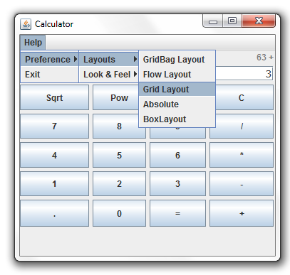

# CalculatorWithMenu
A calculator application that utilizes the java GUI Libraries with 5 different layout options  and different look and feels. This Calculator utilizes the JMenu objects to change the look of the calculator.

